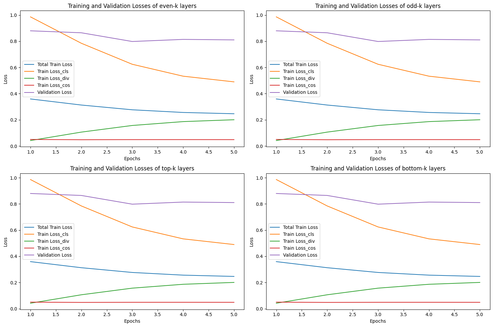

# A6_Student_Layer_Initialization

## Exploring Student Layer Initialization via Distillation using BERT Huggingface

### Student Layer Initialization

In this project, we explore different strategies for initializing the student layers via distillation using BERT from Huggingface.

- **Initialize the Top-K Layers**: We initialize the top K layers (1, 2, 3, 4, 5, 6) from the 12-layer teacher model to the 6-layer student model.

- **Initialize the Bottom-K Layers**: We initialize the bottom K layers (7, 8, 9, 10, 11, 12) from the 12-layer teacher model to the 6-layer student model.

- **Initialize the Odd Layers**: We initialize the odd layers (1, 3, 5, 7, 8, 9, 11) from the 12-layer teacher model to the 6-layer student model.

---

This readme provides an overview of the project and the strategies used for initializing the student layers via distillation. For more details, refer to the project documentation and code.

## Training Results
The model was trained for only a short period due to limited computing resources or time constraints. This could mean the model didn't have enough time to fully learn from the data, resulting in potentially subpar accuracy. Increasing the training time (epochs) could help the model learn more complex patterns and perform better overall, but this might require more computational power and time.

| Layer | Training Loss | Validation Loss | Accuracy  |
| --- | --- | --- | --- |
| Even Layer | 0.245003 | 0.813284 | 0.675000 |
| Odd Layer | 0.246514 | 0.798235 | 0.683000 |
| Top-K Layer | 0.247091 | 0.808383 | 0.679000 |
| Bottom-K Layer | 0.246424 | 0.810205 | 0.670000 |

